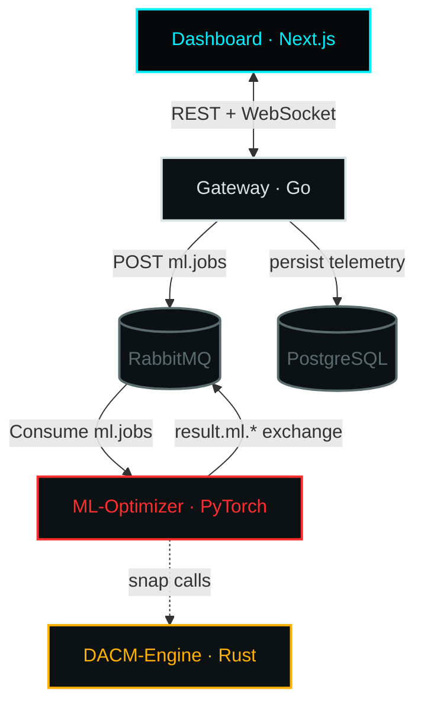

# ❄️ BlackICE-Mesh

> **Polyglot microservices re-architecture of [Adv-Guard](https://github.com/pd241008/Adv-Guard).**
> Min-Max adversarial training, Discrete Adversarial Constraint Mapping (DACM), and dataset
> ingestion retained from the monolith — rebuilt as a high-concurrency, event-driven mesh.

## Why BlackICE-Mesh

The legacy AdvGuard monolith co-located GPU-bound PyTorch simulation behind a FastAPI router,
coupled the UI to a single process, and held ML state in global variables. BlackICE-Mesh
splits those concerns into independently deployable, polyglot services:

- **gateway-service (Go)** — RabbitMQ brokering, high-throughput network I/O, WebSocket fan-out,
  PostgreSQL persistence.
- **dacm-engine (Rust)** — memory-safe, zero-`unsafe` reimplementation of the DACM snapping
  math (`argmax` Euclidean nearest-neighbor snapping onto one-hot vertices, `L_inf` projection,
  Min-Max clamping). ~10M snap passes/sec on commodity hardware.
- **ml-optimizer (Python)** — the retained PyTorch core: Min-Max adversarial training, FGSM/PGD/JSMA
  attacks, ensemble defence, Clean/Robust Accuracy + ASR telemetry. GPU-isolated via Docker.

### Evaluation Conventions

Three distinct evaluation conventions are used in this codebase. They are not interchangeable:

| Convention | Categorical handling | α_cat | Denominator | Hardened @ ε=0.15 (NSL-KDD) |
|---|---|---|---|---|
| **Legacy** (AdvGuard original) | argmax→one-hot, alpha_cat=0.01 (dead code) | 0.01 | correct/total | 29.10% (external) / 27.69% (this repo) |
| **SNAP** (gradient-snapped K=1) | Single best-by-gradient flip, applied once at end | 1.0 | full test set | 40.36% (faithful, full-scale) |
| **EXH** (exhaustive K=1) | Enumerate all |G| one-hot states, continuous PGD on each, pick worst | 0.0 | clean-correct | 0.00% |

The canonical result for Section III of the paper is **40.36%** (SNAP, full test set, n=22,543). The 77.28% figure is K=0 continuous-only (snap inactive) and is not a valid robustness measure.

See `docs/01-documentation/adrs/001-canonical-exhaustive-evaluation.md` for the full framework.
- **dashboard (Next.js App Router)** — gritty Watch-Dogs terminal UI with neobrutalist frames and
  glassmorphic floating panels, streaming realtime diagnostics over WebSocket.

## Architecture Topology



### Component Breakdown

| Service | Lang | Role |
| :--- | :--- | :--- |
| `gateway-service` | Go | AMQP broker, HTTP API (`/api/v1/jobs`, `/api/v1/results`, `/api/v1/health`), WebSocket `/ws`, Postgres writer. Unified `{success, data, error}` envelope. |
| `dacm-engine` | Rust | Pure DACM constraint snapping library + self-test/benchmark binary. |
| `ml-optimizer` | Python | RabbitMQ worker: attacks (FGSM/PGD/JSMA), defences (adversarial training / ensemble), baseline evaluation, ensemble training. Publishes telemetry. |
| `dashboard` | Next.js | Realtime telemetry terminal. |
| `infra` | compose | Orchestrates the four services + RabbitMQ + PostgreSQL. |

### JSMA Caveat

JSMA (Jacobian-based Saliency Map Attack) is included for completeness but is **not recommended** for mixed-norm evaluation. On UNSW-NB15, JSMA misses 12.0% of true adversarial examples that exhaustive K=1 correctly identifies, and is 10x slower. The non-gradient-based iteration rule ($t \to t \times 0.9$) does not satisfy the same Lipschitz convergence guarantees as PGD. Use PGD for all robustness claims.

### Documentation

- `docs/01-documentation/adrs/` — Architectural Decision Records (001–004)
- `docs/02-postmortems/` — Postmortems (001–003) for evaluation artifacts and engineering failures
- `ml-optimizer/results/` — Evaluation JSON results and workstream summary
- `ml-optimizer/scripts/` — Diagnostic scripts: `consolidated_canonical_table.py`, `section3_faithful_diagnostic.py`, `eval_scalability.py`, `eval_jsma_vs_exhaustive.py`, `trace_logit_reversal.py`

## Getting Started

### 1. Generate the NSL-KDD dataset (once)

```bash
cd ml-optimizer
python download_data.py        # writes ./data/nsl-kdd-train.csv + nsl-kdd-test.csv
```

### 2. Boot the mesh

```bash
cd infra
cp .env.example .env
docker compose up --build
```

- Dashboard: <http://localhost:3000>
- Gateway API: <http://localhost:8080/api/v1/health>
- RabbitMQ UI: <http://localhost:15672>

### 3. Dispatch an attack from the UI or CLI

```bash
curl -X POST localhost:8080/api/v1/jobs \
  -H 'Content-Type: application/json' \
  -d '{"type":"attack.fgsm","payload":{"epsilon":0.15}}'
```

## Repo Layout

```text
BlackICE-Mesh/
├── gateway-service/   # Go: broker, HTTP/WS, persistence
├── dacm-engine/       # Rust: DACM snapping engine
├── ml-optimizer/      # Python: retained PyTorch core + worker
├── dashboard/         # Next.js App Router telemetry terminal
├── infra/             # docker-compose + env templates
├── scripts/           # git-handoff.sh
└── README.md
```

## License

Apache License 2.0 — see [LICENSE](LICENSE).
