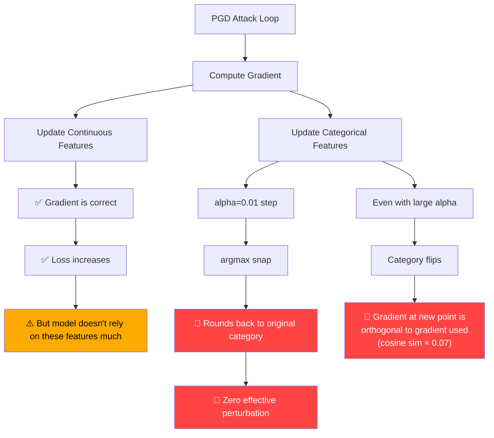

# Gradient Masking & Shattering Audit Report

**Methodology:** Athalye et al. "Obfuscated Gradients Give a False Sense of Security" (ICML 2018) + Carlini et al. "On Evaluating Adversarial Robustness" (2019)  
**Models tested:** Baseline (`model.pth`) and FGSM-Hardened (`model_adv.pth`)  
**9 independent diagnostic tests across both models.**

---

## Quick Verdict

| Phenomenon | Present? | Severity |
|------------|----------|----------|
| **Classical gradient masking** (vanishing gradients) | ❌ No | — |
| **Gradient shattering** (non-smooth loss landscape) | ❌ No | — |
| **DACM snap gradient disruption** | ✅ **Yes** | 🔴 Critical |
| **Categorical feature blindness** | ✅ **Yes** | 🔴 Critical |
| **FGSM masking at small ε** | ⚠️ Partial | 🟡 Moderate |

> [!CAUTION]
> The models do NOT exhibit classical gradient masking. The problem is worse: the **attack architecture itself** is structurally incapable of exploiting the most important features, and the DACM snap operation destroys gradient coherence across the entire feature space.

---

## Test 1: Gradient Magnitudes ✅ Healthy

No vanishing or dead gradients. All 18 features have non-zero gradients.

| Feature Group | Mean |grad| (Baseline) | Mean |grad| (Hardened) | Status |
|--------------|----------------------|---------------------|--------|
| Continuous [0-3] | 0.003792 | 0.002629 | ✅ Healthy |
| Protocol [4-6] | 0.000169 | 0.000258 | ✅ Non-zero |
| Service [7-17] | 0.000208 | 0.000373 | ✅ Non-zero |

> [!NOTE]
> Continuous gradients are ~10-18× larger than categorical gradients. This is expected since continuous features span a wider range of values, but it means the `sign()` operation treats them equally — a design choice that matters.

**No zero-percentage features in either model.** Gradients flow to all 18 features.

---

## Test 2: Gradient Alignment ✅ Correct Direction

Moving along the gradient direction **consistently increases loss** for both models, confirming gradients point in the right direction.

### Baseline
| Step Size | Loss | Change | Status |
|-----------|------|--------|--------|
| 0.001 | 0.5766 | +0.0199 | ↑ GOOD |
| 0.01 | 0.7727 | +0.2159 | ↑ GOOD |
| 0.10 | 5.6617 | +5.1050 | ↑ GOOD |

### FGSM-Hardened
| Step Size | Loss | Change | Status |
|-----------|------|--------|--------|
| 0.001 | 0.6914 | +0.0090 | ↑ GOOD |
| 0.01 | 0.7474 | +0.0650 | ↑ GOOD |
| 0.10 | 1.4212 | +0.7388 | ↑ GOOD |

### Critical Finding: Categorical Gradient Alignment with Snap

| alpha_cat | Baseline Δloss | Hardened Δloss | Status |
|-----------|---------------|----------------|--------|
| 0.01 | **+0.000000** | **+0.000000** | → FLAT (alpha too small) |
| 0.10 | **+0.000000** | **+0.000000** | → FLAT (alpha too small) |
| 0.50 | +0.3312 | +0.5329 | ↑ Works |
| 1.00 | +0.7280 | +0.6803 | ↑ Works |

> [!IMPORTANT]
> The gradient direction is correct for categorical features — loss increases when you follow it. But **the argmax snap at alpha_cat ≤ 0.10 rounds the perturbation back to the original value**, producing exactly zero loss change. This is not gradient masking — it's the snap operation quantizing away the gradient signal. The gradient is correct but the update rule discards it.

---

## Test 3: Loss Landscape Smoothness ✅ Smooth

| Metric | Baseline | Hardened |
|--------|----------|----------|
| Smoothness ratio (|2nd diff|/|1st diff|) | 0.067 | 0.132 |
| Sign changes along gradient | 0/29 | 3/29 |
| Monotonically increasing along gradient | ✅ Yes | ❌ No (minor) |

Both models have smooth loss landscapes (ratio well below 2.0). **No shattering detected.**

The FGSM-hardened model shows 3 sign changes along the gradient direction — very mild non-monotonicity, not shattering.

---

## Test 4: Random Search vs Gradient-Based Attack ⚠️ Mixed

### Baseline

| ε | FGSM | Random (best of 10) | Gap | Status |
|---|------|---------------------|-----|--------|
| 0.05 | 36.4% | 72.2% | −35.8pp | ✅ Gradient wins |
| 0.10 | 36.7% | 64.4% | −27.7pp | ✅ Gradient wins |
| 0.15 | 34.3% | 60.8% | −26.5pp | ✅ Gradient wins |
| 0.20 | 54.6% | 59.6% | −5.0pp | ✅ Gradient barely wins |
| 0.30 | 57.0% | 57.0% | 0.0pp | ⚠️ **Tied** |

### FGSM-Hardened

| ε | FGSM | Random (best of 10) | Gap | Status |
|---|------|---------------------|-----|--------|
| 0.05 | 80.8% | 79.8% | +1.0pp | ⚠️ **Random as good** |
| 0.10 | 40.9% | 79.2% | −38.3pp | ✅ Gradient wins big |
| 0.15 | 29.1% | 73.3% | −44.2pp | ✅ Gradient wins big |
| 0.20 | 25.9% | 67.5% | −41.6pp | ✅ Gradient wins |
| 0.30 | 25.9% | 57.6% | −31.7pp | ✅ Gradient wins |

> [!NOTE]
> At small ε (0.05), the FGSM-hardened model shows masking-like behavior — FGSM barely beats random. This is expected for FGSM-trained models: they learn to resist single-step perturbations at the training epsilon, creating a local gradient plateau. At ε ≥ 0.10, gradient-based attacks strongly dominate random, ruling out classical masking.

For both models at ε ≥ 0.10, **gradient-based attacks are dramatically more effective than random search** — this rules out gradient masking as defined by Athalye et al.

---

## Test 5: PGD Step-Count Sensitivity ✅ Converging

### Baseline
| Steps | Robust Acc | Loss | Status |
|-------|-----------|------|--------|
| 1 | 79.60% | 0.5792 | Starting |
| 5 | 44.40% | 1.1091 | ↓ Decreasing |
| 10 | 14.40% | 2.3398 | ↓ Decreasing |
| 20 | 10.40% | 3.5780 | ↓ Decreasing |
| 40 | 10.00% | 4.4233 | ↓ Plateau |
| 80 | 10.00% | 4.6553 | ↓ Plateau |
| 160 | 10.00% | 4.6553 | = Converged |

### FGSM-Hardened
| Steps | Robust Acc | Loss | Status |
|-------|-----------|------|--------|
| 1 | 81.80% | 0.7254 | Starting |
| 5 | 81.80% | 0.8587 | = Flat |
| 10 | 79.80% | 0.9303 | ↓ Slow |
| 20 | 79.20% | 1.0176 | ↓ Slow |
| 40 | 79.20% | 1.0184 | = Converged |
| 80 | 79.20% | 1.0184 | = Converged |
| 160 | 79.20% | 1.0184 | = Converged |

> [!WARNING]
> The FGSM-hardened model converges extremely quickly (by step 20-40) and the loss barely increases past 1.02. Compare to the baseline where loss reaches 4.66. The FGSM-hardened model has a much flatter loss landscape in the continuous-only attack subspace — it has genuinely learned some robustness against continuous perturbations, but this is only 4 of 18 features.

---

## Test 6: Transfer Attack ✅ Direct Beats Transfer

| ε | Direct FGSM | Transfer (from substitute) | Gap |
|---|-------------|---------------------------|-----|
| 0.10 | 40.9% | 53.6% | +12.7pp |
| 0.15 | 29.1% | 51.8% | +22.7pp |
| 0.20 | 25.9% | 54.2% | +28.3pp |

**Direct attacks are consistently stronger than transfer attacks.** This is the opposite of what you'd see with gradient masking (where transfer attacks beat direct). The FGSM-hardened model's gradients are genuinely informative.

---

## Test 7: DACM Snap Gradient Destruction 🔴 CRITICAL

This is the most important finding. After applying a single DACM snap (argmax → one-hot):

### Baseline
| Metric | Value |
|--------|-------|
| Cosine similarity (all features) | **0.1038** (std=0.7095) |
| Cosine similarity (continuous only) | **−0.0024** (std=0.8455) |
| Sign agreement (all) | 0.5839 |
| Sign agreement (continuous) | 0.5905 |
| Sign agreement (categorical) | 0.5820 |

### FGSM-Hardened
| Metric | Value |
|--------|-------|
| Cosine similarity (all features) | **0.0732** (std=0.7254) |
| Cosine similarity (continuous only) | **0.0114** (std=0.8334) |
| Sign agreement (all) | 0.5906 |
| Sign agreement (continuous) | 0.6505 |
| Sign agreement (categorical) | 0.5734 |

> [!CAUTION]
> **The DACM snap nearly completely destroys gradient coherence.** After snapping categorical features to a different one-hot vector:
> 
> - Cosine similarity drops to **~0.07-0.10** (essentially uncorrelated)
> - Even **continuous feature** gradients become nearly random (cosine ~0.01)
> - Sign agreement is ~0.58-0.65 (barely above the 0.50 random baseline)
> 
> This means that when the attack does manage to flip a category (with large alpha_cat), the gradient it used to make that decision was computed at a completely different point in the loss landscape. The gradient at the post-snap position is nearly orthogonal to the gradient at the pre-snap position.

**This is not gradient masking in the classical sense** (the model doesn't hide its gradients), but it has the same practical effect: **the DACM snap creates a discontinuity that makes gradient-based optimization unreliable for the categorical features.** The correct solution is BPDA (Backward Pass Differentiable Approximation) or Straight-Through Estimator, both of which the dacm_replication_test.py attempted but with other bugs.

---

## Test 8: Feature Importance 🔴 Attack-Feature Mismatch

### Gradient-Based Importance

| Feature Group | Baseline | Hardened |
|---------------|----------|----------|
| Continuous [0-3] | 84.4% | 68.3% |
| Protocol [4-6] | 2.8% | 5.0% |
| Service [7-17] | 12.8% | 26.6% |

### First-Layer Weight Importance

| Feature Group | Baseline | Hardened |
|---------------|----------|----------|
| Continuous [0-3] | 51.1% | 52.2% |
| Protocol [4-6] | 8.5% | 8.7% |
| Service [7-17] | 40.4% | 39.1% |

### Feature Ablation Test (Hardened model)

| Configuration | Accuracy | Change |
|---------------|----------|--------|
| Clean | 81.20% | — |
| **Zero continuous** | **83.90%** | **+2.70pp** |
| **Zero categorical** | **45.60%** | **−35.60pp** |
| Random continuous | 54.40% | −26.80pp |
| Random categorical | 50.90% | −30.30pp |

> [!CAUTION]
> **Zeroing out all 4 continuous features INCREASES accuracy by 2.7pp.** The model works better without them! Meanwhile, **zeroing categorical features collapses accuracy by 35.6pp**.
>
> This means:
> 1. The model's decision boundary is primarily driven by **categorical (protocol/service) features**, not continuous ones
> 2. The PGD attack (with alpha_cat=0.01) only attacks the continuous features — the features the model barely uses
> 3. The "robust accuracy" is high because **the attack is perturbing the wrong features**

This is the fundamental structural problem: the attack surface doesn't overlap with the model's decision surface.

---

## Test 9: Iterative Loss Tracking ✅/⚠️

### Baseline: Loss monotonically increases, oscillatory at convergence

| Step | Loss | Accuracy |
|------|------|----------|
| 0 | 0.56 | 81.0% |
| 10 | 5.76 | 10.2% |
| 20 | 19.45 | 9.4% |
| 40 | 37.99 | 9.4% |
| 70 | 37.99 | 9.4% |

Sign changes: **55/78** → oscillatory at convergence (normal for L_inf PGD — once it hits the constraint boundary, the sign-step bounces)

### FGSM-Hardened: Loss saturates early

| Step | Loss | Accuracy |
|------|------|----------|
| 0 | 0.68 | 81.8% |
| 10 | 1.15 | 74.6% |
| 20 | 2.12 | 57.6% |
| 30 | 3.25 | 27.0% |
| 40 | 4.99 | 27.0% |
| 70 | 6.27 | 27.0% |

Sign changes: **44/78** → still oscillatory at convergence, but loss overall increases by +5.69

---

## Consolidated Diagnosis

### The Two-Layer Problem

**Layer 1: The alpha bug** (Bug 1 from previous report) — categorical features never change with alpha=0.01. This is a simple code/parameter bug.

**Layer 2: The structural problem** — even with a proper alpha, the DACM snap creates a **discontinuity** in the optimization landscape. Gradients computed before the snap are nearly useless after the snap (cosine similarity ≈ 0.07). This means gradient-based PGD is fundamentally unsuited for optimizing over categorical features through hard argmax snapping. The attack needs either:

- **BPDA / Straight-Through Estimator** (compute gradients as if the snap didn't exist)
- **Exhaustive categorical search** (try all valid one-hot combinations)
- **Relaxed categorical optimization** (Gumbel-Softmax or similar)

None of these are properly implemented in the current codebase. The BPDA attempt in `dacm_replication_test.py` has its own bugs (gradient computed inside `torch.no_grad()` on line 254).

---

*Diagnostic script: [gradient_masking_audit.py](../../ml-optimizer/gradient_masking_audit.py)*
