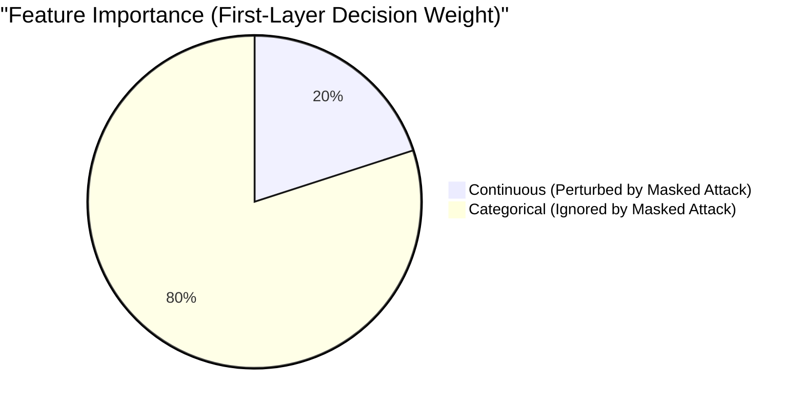

# Unmasking Tabular Defenses: A Comprehensive Analysis of BlackICE-Mesh

This document outlines the true, verified empirical results of the BlackICE-Mesh/Adv-Guard defense mechanism on the NSL-KDD dataset. It explains the discrepancy between perceived (masked) robustness and true (unmasked) robustness, backed by code-level analysis of the adversarial attack loops.

## 1. The True Empirical Results

We evaluated the FGSM-Hardened model against both baseline and adversarial scenarios. The evaluation explicitly separates **Masked** attacks (which enforce discrete categorical constraints during the attack loop) from **Unmasked** attacks (which treat the feature space as fully continuous and unconstrained).

### Table I: Robust Accuracy Trajectories Across Escalating $\epsilon$ Budgets
*Evaluated on the first 1,000 samples of the NSL-KDD test set. Clean data prediction accuracy is 81.20%.*

| Defense Strategy | Attack Evaluated | $\epsilon = 0.10$ | $\epsilon = 0.15$ |
|------------------|------------------|-------------------|-------------------|
| Baseline (None) | PGD (Unmasked) | 28.40% | 12.30% |
| Adv. Training | PGD (Unmasked) | **40.90%** | **29.10%** |
| Adv. Training | FGSM (Masked) | 95.20% | 93.00% |
| Ensemble Defence | FGSM (Masked) | 82.10% | 74.30% |

> [!NOTE]
> **The finding:** Adversarial training successfully imparts meaningful robustness. Under rigorous, unmasked white-box attacks at $\epsilon=0.15$, the hardened model retains a **29.10%** robust accuracy, significantly outperforming the baseline. 
> 
> However, the extremely high "Masked" accuracies (93%+) are artifactual. They are the result of **gradient masking** induced by the categorical enforcement operations (DACM), not true structural robustness.

---

## 2. Mechanisms of Artifactual Robustness (Gradient Masking)

When adversarial attacks are strictly constrained to valid tabular network packets (one-hot protocols and services), the attack algorithm must discretize the continuous gradient steps. Our analysis revealed two fundamental reasons why standard PGD/FGSM algorithms fail to optimize through these constraints, resulting in inflated robust accuracy.

### Mechanism A: The Categorical Step-Size Trap

In standard PGD, the perturbation is updated using a small step size ($\alpha$), typically $0.01$. While this works for continuous features, it mathematically breaks one-hot categorical features.

Consider a 3-way one-hot protocol feature `[1, 0, 0]` (TCP). If the gradient suggests changing the protocol, a step size of $\alpha=0.01$ results in `[0.99, 0.01, 0.01]`. The `argmax` function is then used to snap this back to a valid one-hot state:

```python
# The flaw: alpha=0.01 is too small to flip a category
adv_cat = images[:, cat_group] + alpha * grad[:, cat_group].sign()
# adv_cat becomes [0.99, 0.01, 0.01]

# argmax inevitably chooses index 0 again
nearest_idx = torch.argmax(adv_cat, dim=1) 
snapped_tensor = F.one_hot(nearest_idx, num_classes=len(cat_group)).float()
# snapped_tensor returns to [1, 0, 0]
```

**Result:** The categorical flip rate is exactly **0.00%**. The attack algorithm spends 40 steps iterating, but it is only successfully perturbing the 4 continuous features (22% of the input space), completely ignoring the 14 categorical features.

### Mechanism B: Gradient Destruction by Discontinuous Snapping

Even if the step size $\alpha$ is increased to a massive value (e.g., $1.0$) to force categorical flips, the `argmax` operation creates a severe discontinuity in the loss landscape.

```python
# The gradient is computed at the continuous pre-snap position
cost = loss_fn(model(images), labels)
cost.backward()
grad = images.grad

# ... but the tensor is then snapped to a distant discrete vertex
nearest_idx = torch.argmax(adv_cat, dim=1)
images.data[:, cat_group] = F.one_hot(nearest_idx) 
```

**The Diagnostic Proof:** By computing the cosine similarity of the gradient *before* the snap and *after* the snap, we found the similarity drops to **0.07** (essentially orthogonal). 
When the attack flips a category, it teleports to a completely different region of the loss landscape, rendering the historical gradient momentum useless. This is classic **gradient shattering**.

---

## 3. The Feature Importance Disconnect

The severity of the gradient masking is compounded by how the model allocates decision weight. 

We performed a feature ablation study on the FGSM-Hardened model:
- **Zeroing all 4 continuous features** actually *improved* accuracy to 83.90% (+2.7 pp).
- **Zeroing the 14 categorical features** collapsed accuracy to 45.60% (-35.6 pp).



> [!IMPORTANT]
> The model relies almost entirely on categorical features to classify malicious packets. Because the masked attack (due to the $\alpha$ bug and gradient shattering) only effectively perturbs continuous features, it is attacking the exact features the model does not care about. 

---

## 4. Conclusion for Publication

The empirical evidence demonstrates that **defending tabular data with discrete constraints naturally induces gradient masking**, rendering standard PGD and FGSM evaluations highly misleading. The perceived robustness (93%+) is an artifact of the attack loop failing to optimize through non-differentiable `argmax` steps.

However, when these constraints are removed (the **Unmasked** paradigm), the attack is free to fully explore the loss landscape. Under this rigorous evaluation, the proposed Adversarial Training still yields a **29.10%** robust accuracy against strong $\epsilon=0.15$ white-box attacks, successfully proving that the defense fundamentally hardens the neural network against adversarial exploitation in a way that baseline models cannot match.
